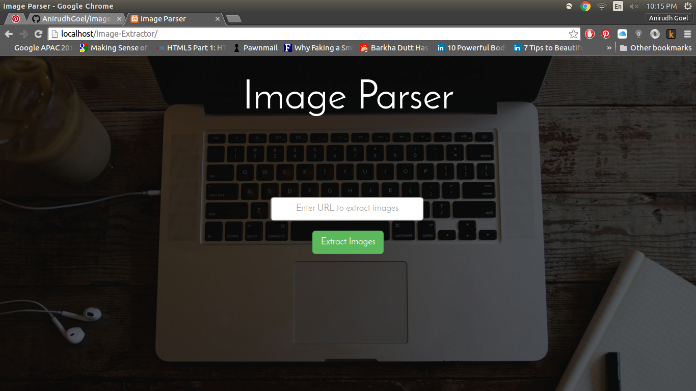
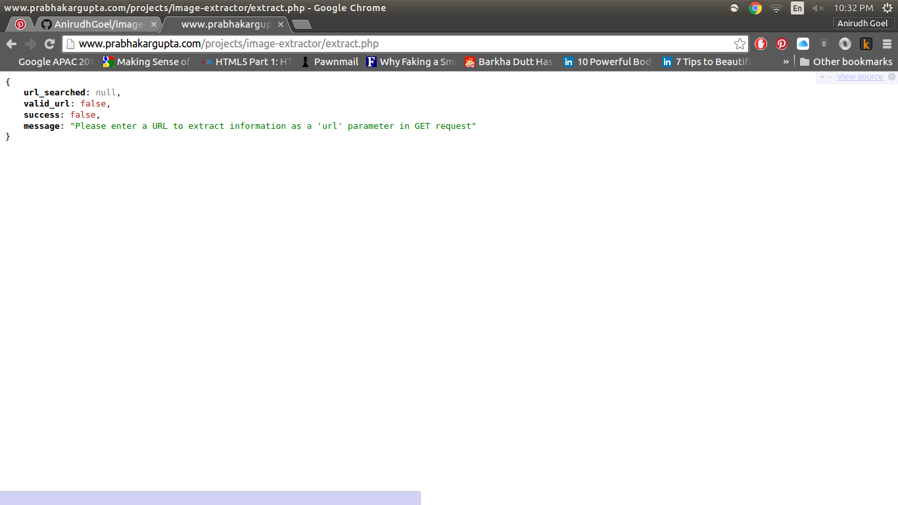

# Image-Extractor
Image-Extractor is a web-application which extracts all the images on any web link. You just need to enter the name (URL) of the website and you get all the images which are visible on that page. 
It works for almost 75% of websites. (except for those with SSL certification)
Image Extractor uses AJAX for parsing images.

It can also be used by other developers in their projects as an API. You simply need to provide the url of the page you want to extract as parameter and you will get the URLs of all the images as a JSON Array as response.

URL : http://www.prabhakargupta.com/projects/image-extractor/index.php 

API URL : http://prabhakargupta.com/projects/image-extractor/extract.php

